# Forudsætning

Tjek at du SSH-adgang til GNS3 VM (eller GNS-server).
Brugernavn/kode er gns3/gns3.

# Opsætning af pfSense

## Opret pfSense VM i QEMU

Hent et pfSense image og opret en QEMU VM i GNS3 med 6 (eller flere)
net interfaces.

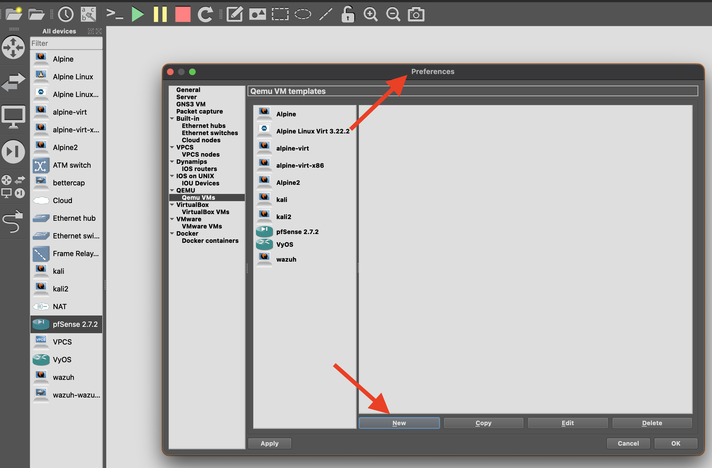


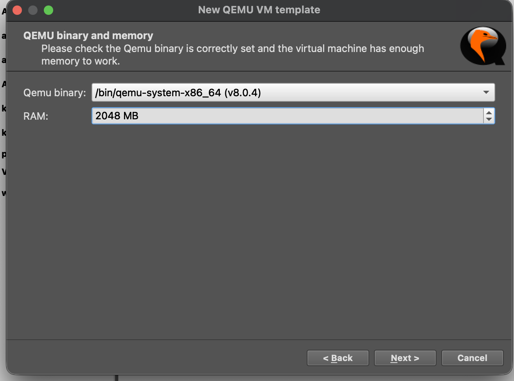

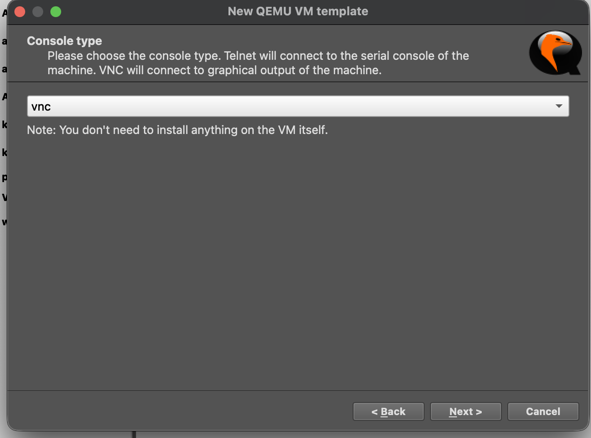

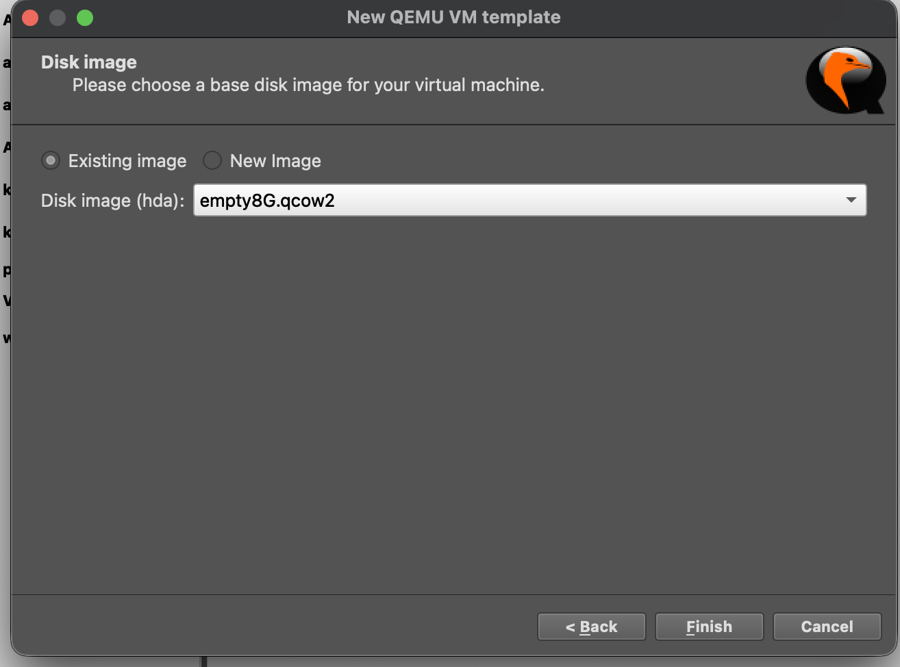

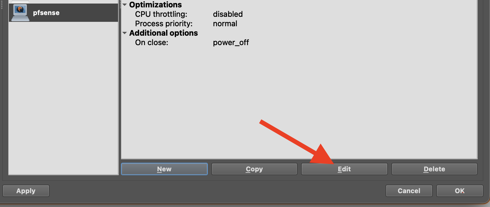

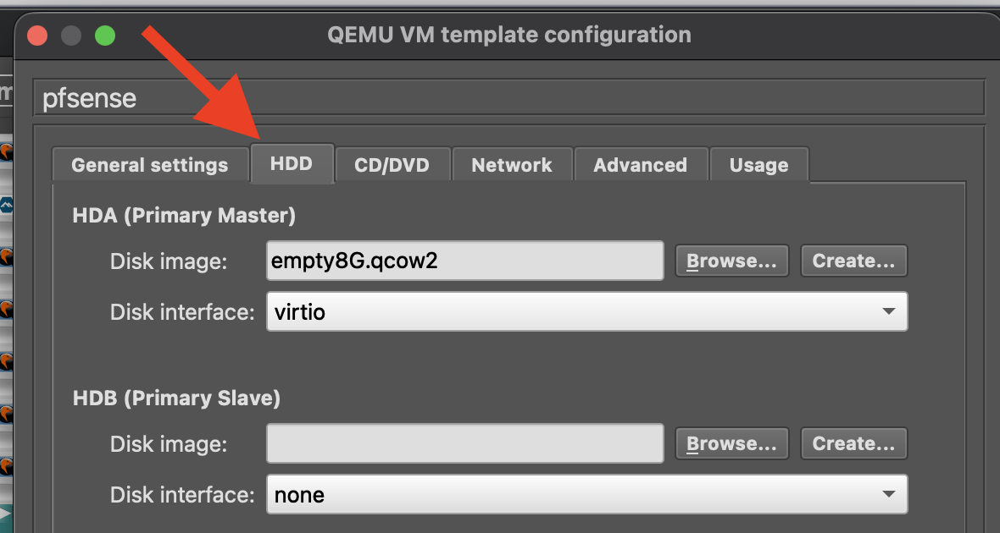

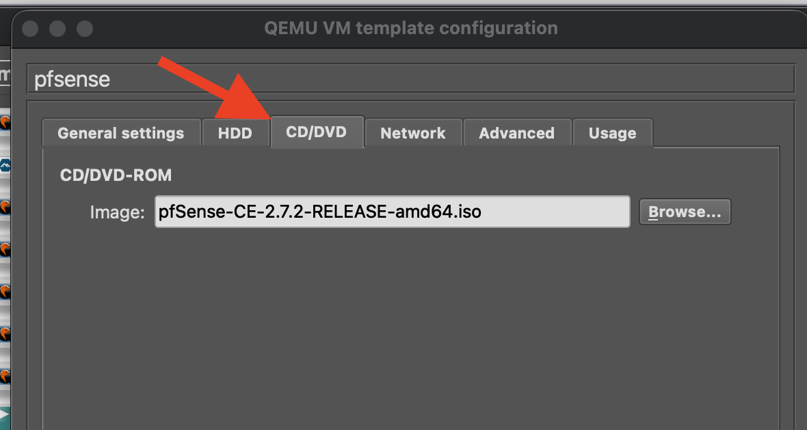

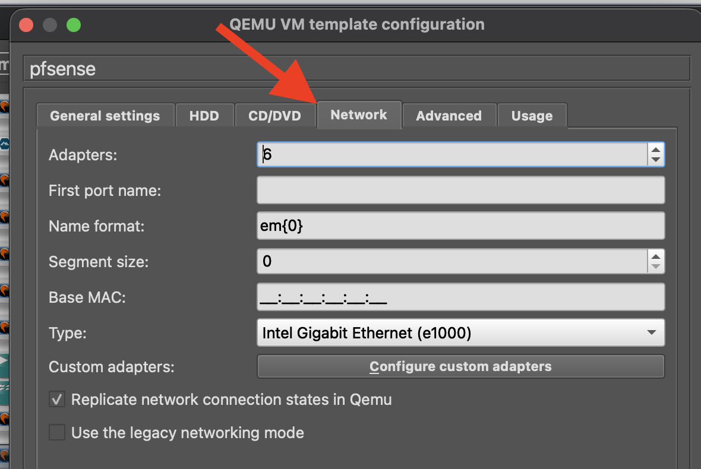

## Konfigurer pfSense

Forbind til pfSense over VNC og følg installation ved bare at vælge
alt som default.

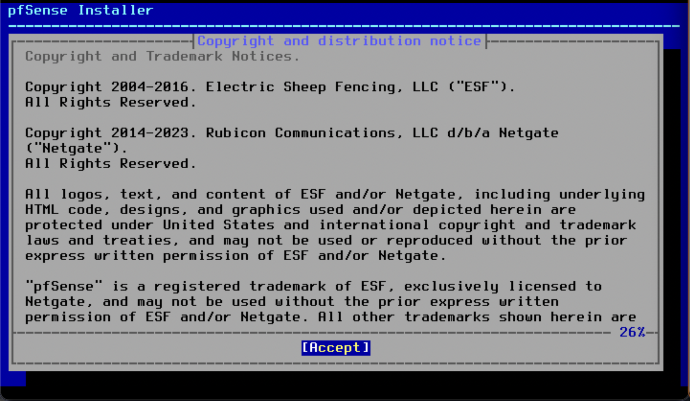

Det skulle gerne ende med at så ud på følgende måde.

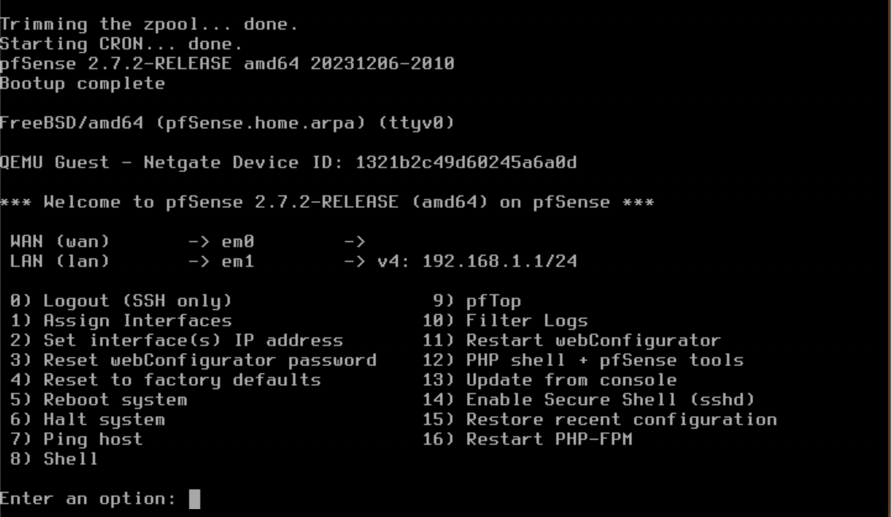

### Opret forbindelse gennem WAN til internettet

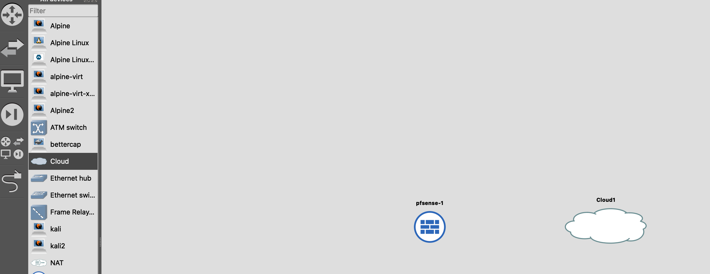
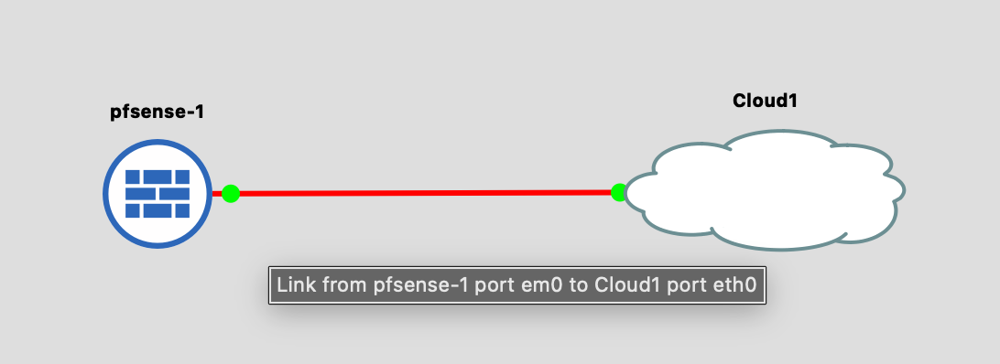
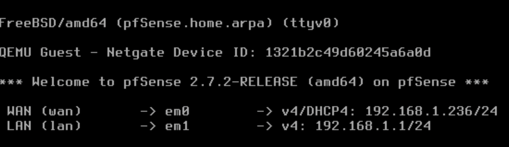
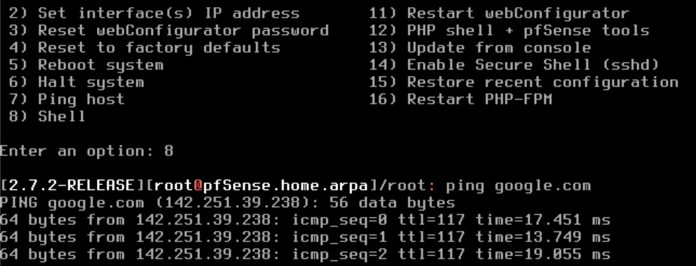

### Sæt LAN op

Vælg `2) Set interface(s) IP address`

Vælg LAN og `n` til at sætte op via DHCP.

Vælg en lokal IP, eg `10.100.1.250`.

Vælg subnet bit count 24.

Ignorer opsætning af IPv6.

Start DHCP server på LAN og vælg address range (eg 10.100.1.10-200).

Test forbindelse ved at forbinde til et virtuelt net interface på GNS3 VM.

Dette kan f.eks. gøres på følgende måde. Først opret det virtuelle interface
```
ip tuntap add tap0 mode tap
```
Derefter fobind det til LAN-interfacet på pfSense og kør
```
dhclient tap0
```
på VM'en. Test forbindelsen med `ping 10.100.1.250`.

### Færdiggør opsættelse af pfSense gennem browser

Opret forbindelse til pfSense gennem en browser.
Dette kan f.eks. gøres ved at lave en SSH-tunnel gennem den LAN
forbindelse der er mellem VM'en og pfSense. Alternativt kan man gøre
det direkte i VM'en hvis den har en browser.
``` 
ssh -N -L localhost:8080:10.100.1.250:80 gns3@<VM-ip>
```
Brugernavn/kode til webinterfacet er admin/pfsense.

# Opret alpine VM i QEMU og opsætning

Gør tilsvarende som for pfSense. Alternativt brug alpine docker fra
https://www.gns3.com/marketplace/appliances/alpine-linux-2
og brug 'Import Appliance' fra GNS3.

Forbind alpine til pfSense i GNS3 og brug
```
udhcpc eth0
```
for at få en IP-addresse (og internetadgang) via pfSense.

# unencrypted telnet from alpine to pfSense

Start en telnet listener på pfSense
```
nc -lv 9001
```
og forbind til den fra alpine
```
apk add busybox-extras
telnet <pfSense-ip> 9001
```
og se den ukrypterede kommunikation i Wireshark.

Wireshark kan tilgås ved at højreklikke på forbindelse og vælge 'Capture'.

# Web

## QEMU alpine

```
apk add apache2
rc-service apache2 start
rc-update add apache2
```

Test evt. med `curl localhost` (evt. først `apk add curl`).

## Docker alpine

Docker-version af alpine har ikke OpenRC.

```
apk add apache2
httpd
```

# ARP spoofing/banning

## bettercap på alpine

```
apk add --repository http://dl-cdn.alpinelinux.org/alpine/edge/testing bettercap
bettercap
```

### ARP-spoofing
```
arp.spoof on
```

Test at det virker, ved at bruge Wireshark på forbindelsen mellem
maskinen der kører `bettercap` og routeren, og se at kommunikation fra
andre maskiner til gatewayen bliver opfanget.

### ARP-banning
```
arp.ban on
```

Test at det virker, ved at se, at andre maskiner ikke længere kan
tilgå gateway'en.

## arpspoof på kali linux

```
sudo arpspoof -i eth0 -t <target-ip> <gateway-ip>
```

Test at det virker, ved at bruge Wireshark på forbindelsen mellem
Kali-maskinen der kører og routeren, og se at kommunikation fra
andre maskiner til gateway'en bliver opfanget.

# Images

QEMU Kali image
https://www.kali.org/get-kali/#kali-virtual-machines

Alpine Virtual x86_64
https://www.alpinelinux.org/downloads/

pfSense Community Edition 2.7.2 amd64
https://repo.ialab.dsu.edu/pfsense/
